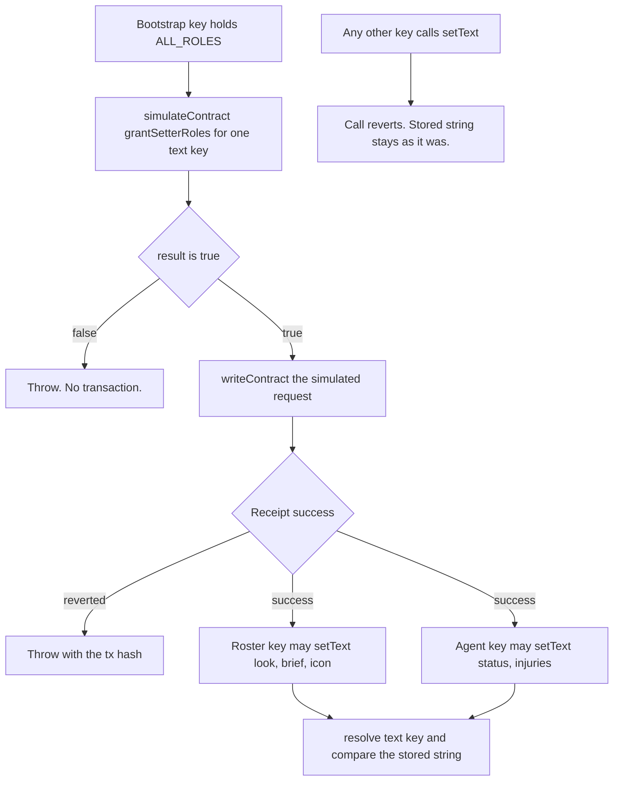

# ENSv2

Vendor: ENS. Product: ENSv2 on the 15 September 2026 Sepolia pin,
`contracts-v2` commit `71a3b7339dbc55ab47667abdfe8303bac4f4c24e`
(`packages/ens/scripts/pin.ts`). The permissioned resolver implementation
in that pin is `PermissionedResolverImpl`
`0x14f09fd05d4585759e54844dc9b00147131cf243`
(`packages/ens/scripts/pin/sepolia-addresses.md`).

This note is the call map for that product, the grant-and-write flow, and
the local validation of write permission. Parent-name registration is
`docs/ens-sepolia-parent.md`. Text keys are `docs/character-card-fields.md`.

## Where the product is called

| ENSv2 call | File | Lines |
| --- | --- | --- |
| ABI: `initialize`, `setText`, `resolve`, `grantSetterRoles` | `packages/ens/scripts/abis.ts` | 52–57 |
| `grantSetterRoles` simulate, require `true`, then send | `packages/ens/scripts/grant-text-roles.ts` | 37–77 |
| Roster keys `look`, `brief`, `icon`; agent keys `status`, `injuries` | `packages/ens/scripts/grant-text-roles.ts` | 13–16 |
| Grant those keys on the parent resolver | `packages/ens/scripts/character-subnames.ts` | 657–689 |
| `setText` from the wallet that holds the key | `packages/ens/scripts/character-subnames.ts` | 630–655 |
| `resolve` of `text(key)` when registering or updating | `packages/ens/scripts/character-subnames.ts` | 542–576 |
| `resolve` of `text(key)` for the roster reader | `packages/ens/scripts/roster.ts` | 339–369 |
| Web game loads the roster through that reader | `apps/web/game.ts` | 174–180 |
| Local anvil deploys the pinned resolver bytecode | `packages/ens/scripts/local-permissioned-resolver.ts` | 53–65 |
| Tests assert chain id 31337 and log `passFailLocation=` after deploy | `packages/ens/tests/permissions.test.ts` | 299–336 |
| Tests call `setText`, then `resolve`, and compare the string | `packages/ens/tests/permissions.test.ts` | 364–427 |

`grantSetterRoles` encodes `setText` calldata for one key
(`grant-text-roles.ts` `buildSetTextSetter`). The resolver decodes that
calldata and grants `ROLE_SET_TEXT` for that key only. A `false` return
throws in `assertWritePermissionGranted` before `writeContract`.

## Flow

The web game does not grant or write. It calls `readRosterFromChain`, which
uses `resolve`.

## Validation

Commit `4bb096ba5008e80f33c67e714728728d77f8d8ec` on branch
`ens-write-permission-exercise`.

The permission suite deploys the checked-in pin bytecode on local anvil. It
binds a free loopback port. It does not send these writes to the Sepolia
resolver address above.

Two runs of `pnpm --filter @horror-tube/ens test` and
`pnpm --filter @horror-tube/ens typecheck` on that commit:

| Run | Result |
| --- | --- |
| First, while the grant check was written | tests 50, pass 48, fail 0, skipped 2; typecheck exit 0 |
| Second, a fresh run by a different model (Claude Opus) | tests 50, pass 48, fail 0, skipped 2; typecheck exit 0 |

The second run's permissioned-resolver cases, all passed:

| Case | What it checked |
| --- | --- |
| `accepts a true grant result` / `rejects a false grant result with grant context` (`permissions.test.ts` 223, 229) | `true` continues. `false` throws with the key, the account, and `result=false`. |
| `exposes grantSetterRoles on the pinned ABI` (385) | The ABI used for grants is `grantSetterRoles`, selector `0xc7279f88`. |
| `agent can overwrite status and injuries` (401) | Agent writes `alive` then `dead`, `[]` then `["left arm"]`. Each `resolve` matches. |
| `roster can overwrite look, brief, and icon` (412) | Roster writes then overwrites `look`, `brief`, and `icon`. Each `resolve` matches. |
| `bootstrap can set all five card keys` (428) | Bootstrap writes `status`, `injuries`, `look`, `brief`, and `icon`. Each `resolve` matches. |
| `agent reverts on roster keys` (448) | Agent `setText` of `look`, `brief`, and `icon` reverts. Stored text unchanged. |
| `roster reverts on agent keys` (458) | Roster `setText` of `status` and `injuries` reverts. Stored text unchanged. |
| `a third non-bootstrap key reverts on all five text keys` (464) | A key with no grant reverts on all five. |
| `fight and roster process config reject the bootstrap address` | Roster and agent env loading refuse the bootstrap address. |

The two skips are the Sepolia smoke check and the gated register. They stay
off unless `ENS_LABEL`, `SEPOLIA_RPC_URL`, and `ENS_E2E=1` are set. The
permission cases above ran.

`pnpm --filter @horror-tube/ens typecheck` exited 0 on both runs. CI on
pull request 88 was green after the first run, including the `ens` job.

## Where the pass/fail test ran

The suite starts its own local anvil with `--chain-id 31337` and deploys the
pinned bytecode there. The Sepolia address at the top of this note is where
that bytecode came from. The suite sends nothing to Sepolia.

After the deploy, the test asserts the chain id, checks that the factory,
implementation, and `deployProxy` transactions came from the bootstrap
address, and logs one `passFailLocation=` line. Every `setText` in the suite
is signed by one of the four accounts below. A mined write is checked against
its signer.

| Field | Value |
| --- | --- |
| Chain | Local anvil started by the test |
| Chain id | `31337` |
| Resolver proxy (received the writes) | `0x0A87B698B0D94e96081d01863565Da2Ba1bd6282` |
| Deploy block | `3` |
| `deployProxy` transaction | `0x1c7b836f4710834f92ae539b8b3ee7dd42525cf72429c8526f0bad45b02cf507` |
| `VerifiableFactory` | `0x5FbDB2315678afecb367f032d93F642f64180aa3` |
| `PermissionedResolverImpl` (local copy) | `0xe7f1725E7734CE288F8367e1Bb143E90bb3F0512` |

| Role | Address | Result |
| --- | --- | --- |
| bootstrap | `0xf39Fd6e51aad88F6F4ce6aB8827279cffFb92266` | Writes all five keys: `status`, `injuries`, `look`, `brief`, `icon` |
| roster | `0x70997970C51812dc3A010C7d01b50e0d17dc79C8` | Writes `look`, `brief`, `icon`. Reverts on `status` and `injuries` |
| agent | `0x3C44CdDdB6a900fa2b585dd299e03d12FA4293BC` | Writes `status` and `injuries`. Reverts on `look`, `brief`, and `icon` |
| third | `0x90F79bf6EB2c4f870365E785982E1f101E93b906` | Reverts on all five keys |

The four addresses are anvil's first four default dev accounts. Two runs of
`tsx --test tests/permissions.test.ts` logged the same line, the proxy address
included. A fresh anvil with the same deploy order puts the proxy at the same
address on every run.
