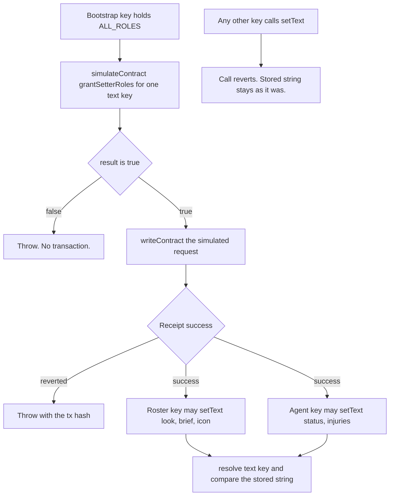

# ENSv2

Vendor: ENS. Product: ENSv2 on the Sepolia pin in `packages/ens/scripts/pin.ts`
(addresses also listed in `packages/ens/scripts/pin/sepolia-addresses.md`).
The permissioned resolver implementation in that pin is `PermissionedResolverImpl`.

This note is the call map for that product, the grant-and-write flow, and
how write permission is validated locally. Parent-name registration is
`docs/ens-sepolia-parent.md`. Text keys are `docs/character-card-fields.md`.

## Where the product is called

| ENSv2 call | Where |
| --- | --- |
| ABI: `initialize`, `setText`, `resolve`, `grantSetterRoles`, `roles`, `hasRoles`, `hasRootRoles` | `packages/ens/scripts/abis.ts` |
| Live read of `hasRootRoles`, `hasRoles`, `roles` on the Sepolia resolver | `packages/ens/scripts/read-setter-roles.ts` |
| `grantSetterRoles` simulate, require `true`, then send | `packages/ens/scripts/grant-text-roles.ts` (`buildSetTextSetter`, `assertWritePermissionGranted`) |
| Roster keys `look`, `brief`, `icon`; agent keys `status`, `injuries` | `packages/ens/scripts/grant-text-roles.ts` |
| Grant those keys on the parent resolver | `packages/ens/scripts/character-subnames.ts` |
| `setText` from the wallet that holds the key | `packages/ens/scripts/character-subnames.ts` |
| `resolve` of `text(key)` when registering or updating | `packages/ens/scripts/character-subnames.ts` |
| `resolve` of `text(key)` for the roster reader | `packages/ens/scripts/roster.ts` (`readRosterFromChain`) |
| Web game loads the roster through that reader | `apps/web/game.ts` (connect/load path calls `readRosterFromChain`) |
| Local anvil deploys the pinned resolver bytecode | `packages/ens/scripts/local-permissioned-resolver.ts` |
| Permission suite: assert chain id 31337, `setText` then `resolve` | `packages/ens/tests/permissions.test.ts` |

`grantSetterRoles` encodes `setText` calldata for one key
(`grant-text-roles.ts` `buildSetTextSetter`). The resolver decodes that
calldata and grants `ROLE_SET_TEXT` for that key only. A `false` return
throws in `assertWritePermissionGranted` before `writeContract`.

## Flow

The web game does not grant or write. It calls `readRosterFromChain`, which
uses `resolve`.

## Validation

Permission tests run on **local anvil chain id 31337**. They deploy the
checked-in pin bytecode on a free loopback port. They do **not** send writes
to the Sepolia resolver.

Run `pnpm --filter @horror-tube/ens test` (and `typecheck` when you change
types). The suite covers:

- A `true` grant continues; a `false` grant throws with the key and account.
- The pinned ABI exposes `grantSetterRoles`.
- Agent can overwrite `status` and `injuries`; roster can overwrite `look`,
  `brief`, and `icon`; bootstrap can set all five card keys.
- Agent reverts on roster keys; roster reverts on agent keys; a third key with
  no grant reverts on all five.
- Fight and roster process config reject the bootstrap address.

Sepolia smoke and gated register stay off unless `ENS_LABEL`,
`SEPOLIA_RPC_URL`, and `ENS_E2E=1` are set.

## Live Sepolia setter roles

The anvil permission suite above is what CI runs. `pnpm ens:roles` is the
live read: it reads `getResolver(ENS_LABEL)` from the pinned `ETHRegistry` on
Sepolia (chain id `11155111`), then calls `hasRootRoles`, `hasRoles`, and
`roles` on that resolver for the bootstrap, roster, and agent wallets derived
from `PRIVATE_KEY`, `ROSTER_PRIVATE_KEY`, and `AGENT_PRIVATE_KEY`. It sends no
transaction.

`ROLE_SET_TEXT` is `1 << 4`. The resource for a text key is
`uint256(keccak256(bytes(key)))`. `can` is `hasRoles(resource, ROLE_SET_TEXT,
account)`, which also counts a root grant. `directRole` is whether
`roles(resource, account)` includes `ROLE_SET_TEXT`.

The command exits 1 and names the account and key unless bootstrap holds the
root text role, roster and agent do not, roster can set only `look`, `brief`,
`icon`, and agent can set only `status`, `injuries`.
